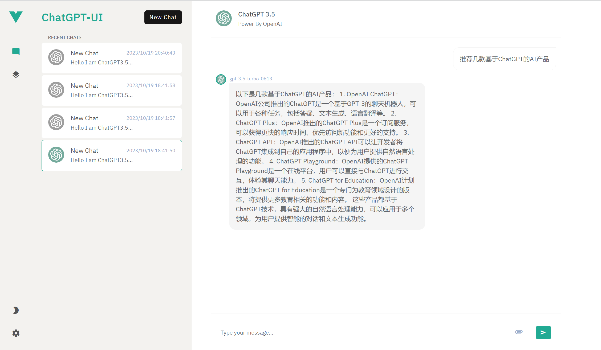

# ChatGPT UI

[中文](README.zh.md)

ChatGPT UI is an open source project that aims to provide users with an easy, intuitive way to converse with ChatGPT. We believe conversation is the most powerful way to connect people with each other and with technology, so we created this front-end UI tool to make interacting with ChatGPT even easier and more fun.



## Feature Highlights:

1. The UI includes file upload functionality to support UI access to Alpha GPT-4 (All Tools) APIs.

2. The UI includes token statistics to easily track billing and input limits.

## Encoding

The encoding specifies how to tokenize text. Different models use different encodings.

| Encoding | OpenAI Model |
|---|---|
| cl100k_base | gpt-4, gpt-3.5-turbo, text-embedding-ada-002 |
| p50k_base | Codex models, text-davinci-002, text-davinci-003 | 
| r50k_base (or gpt2) | GPT-3 models like davinci |

## Preview 1: ChatPDF

Converse with documents


## Preview 2: ChatPDF Document Preview

Preview and discuss documents

 

## Preview 3: ChatGPT API Support [UniConnector](http://portal.uniconnector.com)


## Environment Requirements

Development version: Node 18.15.0 + Vue 3

## Project Configuration

ChatGPT UI's default configuration is stored in the ".env" file. You will need to override some values to get ChatGPT UI running locally.

```env
VITE_APP_URL = Fill in OpenAI's API address or third party encapsulated API, format example: https://api.openai.com/v1/chat/completions

VITE_API_KEY = Fill in OpenAI's ApiKey, format example: sk-FihjnhGKO14eYLmPpV1234BlbkFJUq1lS0RNenkDsjgGLopx

VITE_API_UPLOAD = Fill in the API address to parse PDF files, format example: http://domain.com/upload/pdf 
```

## Project Initialization

```sh
npm install
```

### Running Development Environment

```sh
npm run dev
```

### Accessing the Project 

```sh
http://localhost:1003
```

### Building for Production

```sh
npm run build
```

### Project Communication

QQ Group: 321408266


